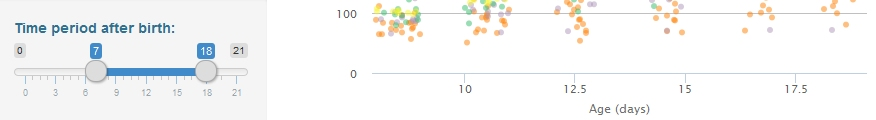
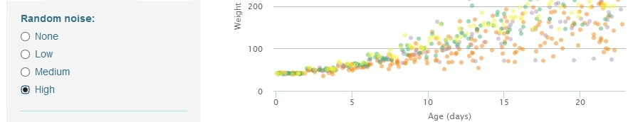
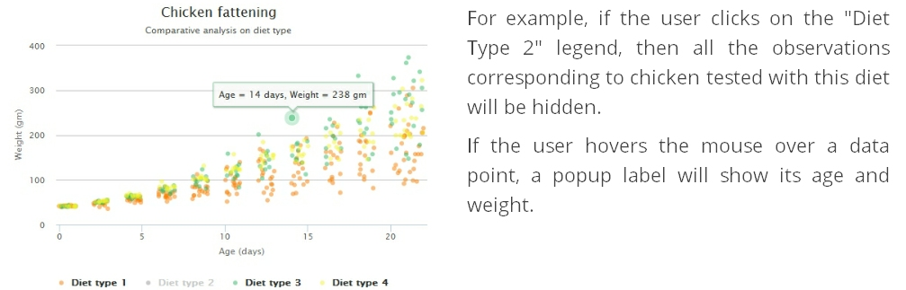

## User inputs

### **Time period after birth.**

Range of living days to display. It determines the interval of days for which **the data are reduced for the plot and results**.
The values in the X axis are delimited by this range.

For example, selecting an interval from 7 to 18 days reduces the available data to chickens aged between 7 and 18 days. The X axis is shortened and the best result on average is computed only for this time period. 

---

## User inputs

### **Random noise**. 

Level of random uniform noise added to the time with the aim of preventing overplotting: None, Low, Medium or High.

When the level of noise is "None", the data points fall together overplotted in the same vertical where X equals to the observed day, since there are data collected only for the even days and the day 21. All the other levels add a progressive quantity of noise to the time in order to scatter the points and be more distant to avoid overlapping. 

This input concerns only to the data point distances in the plot.  

---

## Interactive chart

The chart was created with the rCharts package. It is a scatter plot where each data point is an observation, and it is interactive in two ways: 
* **Showing popup labels** by hovering the mouse over the data points. 
* **Showing or hiding a given diet type** by clicking on its corresponding legend.

